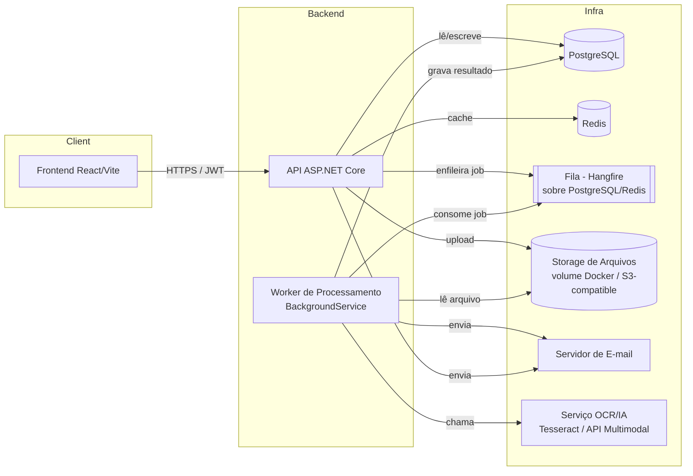
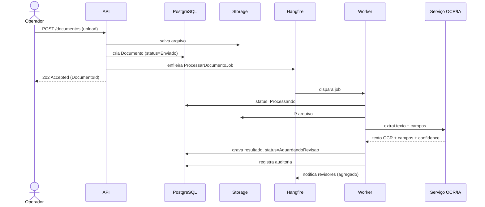
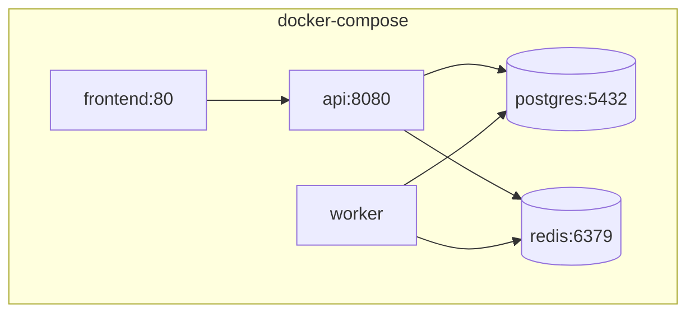

# IntelliDoc — Arquitetura

## 1. Estilo Arquitetural: Clean Architecture (Monolito Modular)

**Decisão:** Clean Architecture dentro de um **monolito modular**, não microsserviços.

**Por quê:**
- O domínio (documentos, aprovação, empresas) é altamente coeso — os módulos conversam entre si o tempo todo (ex.: aprovar documento dispara notificação e atualiza dashboard). Microsserviços introduziriam latência de rede e complexidade de consistência eventual sem benefício real neste estágio.
- Clean Architecture já entrega o principal ganho que se buscaria em microsserviços — baixo acoplamento e alta testabilidade — sem o custo operacional de orquestrar múltiplos serviços, service discovery, etc.
- O **worker de processamento de OCR/IA** é extraído como um **processo separado** (não um microsserviço com API própria, mas um `BackgroundService`/console worker), pois é a parte do sistema com necessidade real de escalabilidade independente (processar muitos documentos em paralelo sem impactar a API). Isso já demonstra domínio de arquitetura distribuída sem exagerar na complessão.

**Alternativa descartada:** Microsserviços completos (serviço de Identidade, serviço de Documentos, serviço de Notificação, cada um com seu próprio banco). Descartado porque adicionaria complexidade de infraestrutura (service mesh, API gateway, consistência distribuída) desproporcional ao tamanho do domínio, e prejudicaria a legibilidade do projeto como peça de portfólio.

## 2. Camadas (Clean Architecture)

```
┌─────────────────────────────────────────────┐
│                   API (Presentation)        │  Controllers, Middlewares, Filters
├─────────────────────────────────────────────┤
│                   Application               │  Commands, Queries, Handlers (MediatR),
│                                             │  DTOs, Validators (FluentValidation),
│                                             │  Interfaces (portas) dos serviços externos
├─────────────────────────────────────────────┤
│                    Domain                   │  Entities, Value Objects, Enums,
│                                             │  Regras de negócio puras, Exceptions de domínio
├─────────────────────────────────────────────┤
│                Infrastructure               │  EF Core, Repositories, Redis, Storage,
│                                             │  Serviço de OCR/IA, E-mail, Hangfire, Serilog
└─────────────────────────────────────────────┘
```

**Regra de dependência:** as setas de dependência sempre apontam para dentro.
`API → Application → Domain`. `Infrastructure → Application/Domain` (implementa
interfaces definidas lá dentro, nunca o contrário). O Domain não depende de
nada — nem de EF Core, nem de ASP.NET.

**Por quê isso importa na prática:** o Domain (regras da Etapa 2) fica
testável sem banco de dados, sem HTTP, sem mocks complicados. Trocar
PostgreSQL por outro banco, ou Tesseract por Azure Document Intelligence,
não deveria exigir tocar em uma linha do Domain.

## 3. Componentes do Sistema



**Decisão — Hangfire como fila:** optamos por Hangfire (com storage no
PostgreSQL) em vez de RabbitMQ/Kafka. Hangfire dá background jobs,
retries automáticos (RN14) e um dashboard de monitoramento pronto,
suficiente para o volume esperado. RabbitMQ/Kafka seriam
over-engineering para o escopo atual, mas a interface
`IDocumentProcessingQueue` na camada de Application isola essa decisão —
trocar para RabbitMQ depois é possível sem tocar em Domain/Application.

**Decisão — Storage:** os arquivos originais dos documentos ficam num
volume Docker local via uma abstração `IFileStorageService`, com a mesma
interface podendo ser implementada futuramente por um provedor
S3-compatible (MinIO/AWS S3) em produção — deixamos isso documentado no
README como ponto de evolução.

## 4. Fluxo Assíncrono de Processamento de Documento (Sequência)



## 5. Multi-tenancy: Estratégia

**Decisão:** Multi-tenancy por **discriminador de coluna** (`EmpresaId` em
toda tabela relevante) dentro de um único banco/schema, com um
`Global Query Filter` do EF Core aplicado automaticamente em todas as
consultas com base no tenant do usuário autenticado.

**Por quê:** É a estratégia com melhor custo-benefício para o tamanho do
projeto — dá isolamento lógico forte (RN02) sem a complexidade
operacional de "banco por tenant" ou "schema por tenant". O Global Query
Filter do EF Core garante que, mesmo que um desenvolvedor esqueça o filtro
em uma nova query, o próprio ORM já bloqueia vazamento entre empresas por
padrão — é uma rede de segurança arquitetural, não apenas convenção de
código.

**Alternativa descartada:** banco de dados por tenant. Descartada por
adicionar complexidade de provisionamento e migrations por tenant,
desproporcional ao objetivo de portfólio (mas mencionaremos como
possibilidade de evolução no README).

## 6. Autenticação e Segurança

- JWT com **access token de curta duração** (15 min) + **refresh token**
  (7 dias, rotativo, armazenado hasheado no banco).
- ASP.NET Core Identity para gestão de usuários/senhas (hashing, políticas).
- Middleware de **resolução de tenant** roda logo após a autenticação,
  extraindo `EmpresaId` das claims do JWT e injetando no
  `ICurrentUserService`, consumido pelo Global Query Filter.
- Rate limiting nativo do ASP.NET Core (`Microsoft.AspNetCore.RateLimiting`)
  nos endpoints de autenticação (RN34).

## 7. Observabilidade

- **Serilog** com sink de console (Docker logs) + arquivo, formato
  estruturado (JSON), enriquecido com `CorrelationId` por requisição
  (middleware customizado), `EmpresaId` e `UserId` quando disponíveis.
- Endpoint de **health check** (`/health`) verificando conexão com banco,
  Redis e fila.
- Dashboard nativo do Hangfire (`/hangfire`, protegido por autenticação de
  admin) para observabilidade dos jobs de processamento.

## 8. Cache (Redis)

Usado para:
- Cache dos indicadores agregados do dashboard (UC25/UC26), invalidado
  por evento (aprovação/rejeição de documento) ou por TTL curto (ex.: 2 min)
  como estratégia dupla de invalidação.
- Cache de configurações da empresa (RN36), invalidado ao salvar (UC32).
- Armazenamento de refresh tokens revogados (blacklist), evitando consulta
  ao banco a cada requisição autenticada.

## 9. Frontend: Arquitetura

- **React + TypeScript + Vite**, com **React Query** para cache/estado de
  servidor (evita duplicar estado do backend no frontend) e
  **React Hook Form + Zod** para formulários e validação de schema.
- Organização por **feature folders** (não por tipo de arquivo) —
  `features/documentos`, `features/aprovacao`, `features/dashboard` — cada
  uma com seus próprios componentes, hooks, e chamadas de API, favorecendo
  coesão sobre a convenção tradicional `components/`, `pages/`, `services/`
  espalhada.
- **Shadcn UI + TailwindCSS** para componentes de UI consistentes e
  acessíveis por padrão, evitando reinventar componentes básicos
  (modais, tabelas, dropdowns).

## 10. Deployment (visão geral)



Todos os componentes sobem via `docker-compose up`, detalhado na Etapa 14.

## 11. Resumo das Decisões Arquiteturais

| Decisão | Escolhida | Alternativa descartada | Motivo resumido |
|---|---|---|---|
| Estilo geral | Monolito modular (Clean Architecture) | Microsserviços | Domínio coeso, evita overhead operacional |
| Processamento pesado | Worker separado (BackgroundService) | Tudo síncrono na API | Não bloquear upload, permitir escalar processamento |
| Fila | Hangfire sobre PostgreSQL | RabbitMQ/Kafka | Suficiente para o volume, menos infra, dashboard pronto |
| Multi-tenant | Coluna `EmpresaId` + Global Query Filter | Banco por tenant | Isolamento forte com baixa complexidade operacional |
| Storage de arquivo | Volume Docker via abstração | S3 direto | Simplicidade local, troca futura sem impacto no domínio |
| Estado de servidor no frontend | React Query | Redux/Context manual | Evita boilerplate de cache/sincronização manual |