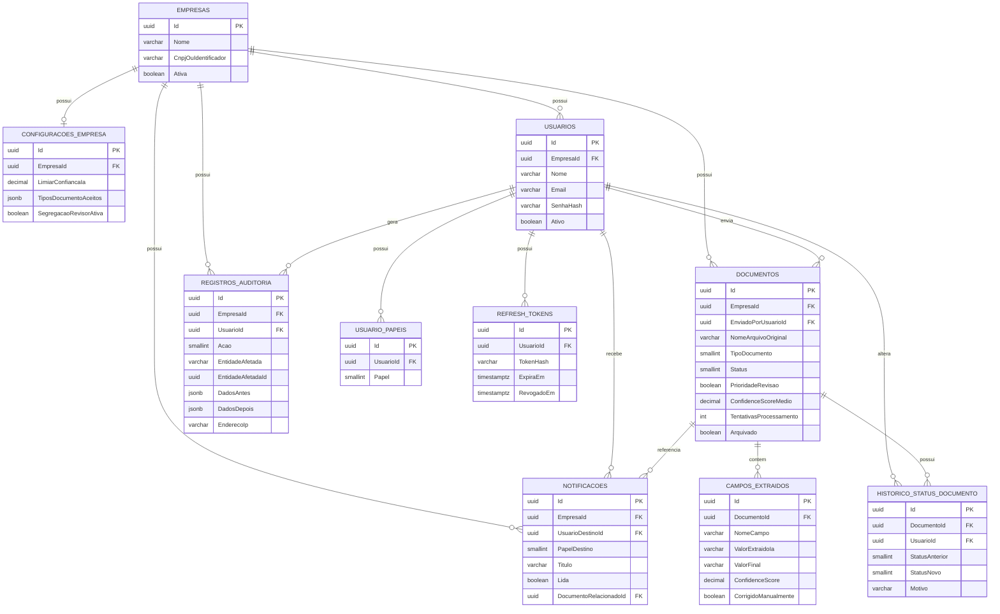

# IntelliDoc — Modelagem do Banco de Dados

## 1. Convenções gerais

- Todas as tabelas possuem `Id` (UUID, chave primária, gerado na aplicação — `Guid.NewGuid()` v7 ordenável, evita fragmentação de índice).
- Todas as tabelas de negócio possuem colunas de auditoria padrão: `CriadoEm`, `CriadoPor`, `AtualizadoEm`, `AtualizadoPor` (preenchidas automaticamente pelo `AuditableEntitySaveChangesInterceptor` do EF Core, ver Etapa 5).
- Tabelas multi-tenant possuem `EmpresaId` (FK), exceto `Empresas` e `Usuarios` de `SuperAdmin` (que tem `EmpresaId` nulo).
- Nomenclatura das tabelas em português, plural (`Documentos`, `Usuarios`), consistente com a decisão de nomenclatura da Etapa 5.
- Nenhuma exclusão física por padrão — tabelas sensíveis têm `Ativo`/`Arquivado` (soft delete) em vez de `DELETE`.

## 2. Entidades

### 2.1 Empresas

| Coluna | Tipo | Regras |
|---|---|---|
| Id | uuid (PK) | |
| Nome | varchar(200) | obrigatório |
| CnpjOuIdentificador | varchar(20) | opcional, único quando informado |
| Ativa | boolean | default true (RN03) |
| CriadoEm | timestamptz | |

### 2.2 ConfiguracoesEmpresa (1:1 com Empresas)

| Coluna | Tipo | Regras |
|---|---|---|
| Id | uuid (PK) | |
| EmpresaId | uuid (FK → Empresas, único) | RN36 |
| LimiarConfiancaIa | decimal(5,2) | default 70.00 |
| TiposDocumentoAceitos | text[] (array) ou jsonb | ex.: `["NotaFiscal","Recibo","Contrato","Outro"]` |
| SegregacaoRevisorAtiva | boolean | default false (RN24) |
| AtualizadoEm | timestamptz | |

### 2.3 Usuarios

| Coluna | Tipo | Regras |
|---|---|---|
| Id | uuid (PK) | |
| EmpresaId | uuid (FK → Empresas, nullable) | nulo apenas para SuperAdmin (RN01) |
| Nome | varchar(150) | obrigatório |
| Email | varchar(256) | único, obrigatório |
| SenhaHash | varchar(500) | via ASP.NET Core Identity |
| Ativo | boolean | default true (RN08) |
| CriadoEm | timestamptz | |

### 2.4 UsuarioPapeis (N:N — Usuario x Papel, RN06)

| Coluna | Tipo | Regras |
|---|---|---|
| Id | uuid (PK) | |
| UsuarioId | uuid (FK → Usuarios) | |
| Papel | smallint (enum: SuperAdmin=0, AdminEmpresa=1, Gestor=2, Revisor=3, Operador=4) | |

> Único (UsuarioId, Papel) — um usuário não pode ter o mesmo papel duplicado.

### 2.5 RefreshTokens

| Coluna | Tipo | Regras |
|---|---|---|
| Id | uuid (PK) | |
| UsuarioId | uuid (FK → Usuarios) | |
| TokenHash | varchar(500) | nunca armazenado em texto plano |
| ExpiraEm | timestamptz | RN10 |
| RevogadoEm | timestamptz (nullable) | preenchido no logout/troca de senha |
| CriadoEm | timestamptz | |

### 2.6 Documentos

| Coluna | Tipo | Regras |
|---|---|---|
| Id | uuid (PK) | |
| EmpresaId | uuid (FK → Empresas) | RN02 |
| EnviadoPorUsuarioId | uuid (FK → Usuarios) | RN12 |
| NomeArquivoOriginal | varchar(300) | |
| CaminhoArmazenamento | varchar(500) | referência no `IFileStorageService` |
| TipoArquivo | varchar(10) | pdf/jpg/png (RN11) |
| TamanhoBytes | bigint | ≤ 10MB (RN11) |
| TipoDocumento | smallint (enum: NotaFiscal, Recibo, Contrato, Outro, NaoClassificado) | RF10 |
| Status | smallint (enum: Enviado, Processando, AguardandoRevisao, Aprovado, Rejeitado, FalhaProcessamento, Arquivado) | RF11 |
| PrioridadeRevisao | boolean | default false (RN16) |
| ConfidenceScoreMedio | decimal(5,2) (nullable) | preenchido após OCR |
| TentativasProcessamento | int | default 0, máx 3 (RN14) |
| TextoOcrBruto | text (nullable) | resultado cru do OCR |
| MotivoRejeicao | varchar(500) (nullable) | RN21 |
| Arquivado | boolean | default false (RN17) |
| CriadoEm | timestamptz | |

### 2.7 CamposExtraidos (1:N com Documentos)

| Coluna | Tipo | Regras |
|---|---|---|
| Id | uuid (PK) | |
| DocumentoId | uuid (FK → Documentos) | |
| NomeCampo | varchar(100) | ex.: "ValorTotal", "DataEmissao", "CnpjFornecedor" |
| ValorExtraidoIa | varchar(500) (nullable) | valor original da IA (RN20) |
| ValorFinal | varchar(500) (nullable) | valor após eventual correção do revisor |
| ConfidenceScore | decimal(5,2) | por campo (RF09, RN16) |
| CorrigidoManualmente | boolean | default false |
| CriadoEm | timestamptz | |

### 2.8 HistoricoStatusDocumento (1:N com Documentos)

| Coluna | Tipo | Regras |
|---|---|---|
| Id | uuid (PK) | |
| DocumentoId | uuid (FK → Documentos) | |
| StatusAnterior | smallint (enum) | |
| StatusNovo | smallint (enum) | |
| UsuarioId | uuid (FK → Usuarios, nullable) | nulo quando a transição é automática (worker) |
| Motivo | varchar(500) (nullable) | preenchido em rejeições (RN21) |
| CriadoEm | timestamptz | RN23 — imutável, sem UPDATE/DELETE previstos |

### 2.9 Notificacoes

| Coluna | Tipo | Regras |
|---|---|---|
| Id | uuid (PK) | |
| EmpresaId | uuid (FK → Empresas) | |
| UsuarioDestinoId | uuid (FK → Usuarios, nullable) | nulo quando é agregada para papel Revisor (RN29) |
| PapelDestino | smallint (enum, nullable) | usado quando UsuarioDestinoId é nulo |
| Titulo | varchar(200) | |
| Mensagem | varchar(1000) | |
| Lida | boolean | default false |
| DocumentoRelacionadoId | uuid (FK → Documentos, nullable) | |
| CriadoEm | timestamptz | expira em 30 dias (RN31, limpeza via job) |

### 2.10 RegistrosAuditoria

| Coluna | Tipo | Regras |
|---|---|---|
| Id | uuid (PK) | |
| EmpresaId | uuid (FK → Empresas, nullable) | nulo em ações de nível de plataforma (ex.: criação de empresa) |
| UsuarioId | uuid (FK → Usuarios, nullable) | |
| Acao | smallint (enum: Login, CriarUsuario, EditarUsuario, MudarPapel, AprovarDocumento, RejeitarDocumento, AlterarConfiguracao, CriarEmpresa, DesativarEmpresa, ...) | RN32 |
| EntidadeAfetada | varchar(100) | ex.: "Documento", "Usuario" |
| EntidadeAfetadaId | uuid (nullable) | |
| DadosAntes | jsonb (nullable) | snapshot antes da alteração |
| DadosDepois | jsonb (nullable) | snapshot depois da alteração |
| EnderecoIp | varchar(45) | RN32 |
| CriadoEm | timestamptz | RN33 — imutável |

## 3. DER (Diagrama de Entidade-Relacionamento)

## 4. Decisões de modelagem relevantes

- **`CamposExtraidos` como tabela separada (não JSON em `Documentos`):** embora fosse mais simples guardar os campos extraídos como um `jsonb` dentro de `Documentos`, optamos por tabela normalizada porque (a) precisamos de `ConfidenceScore` **por campo**, não só por documento (RF09), e (b) facilita consultas/relatórios futuros sobre acurácia de campo específico da IA (ex.: "o campo CNPJ tem confiança média menor que Data").
- **`ValorExtraidoIa` separado de `ValorFinal`:** preserva a RN20 — precisamos saber o que a IA disse originalmente vs. o que ficou após correção humana, para futuramente medir a acurácia do modelo de extração.
- **`HistoricoStatusDocumento` como tabela de eventos imutável, além de `Status` atual em `Documentos`:** o campo `Status` em `Documentos` é a "foto atual" (consulta rápida), mas o histórico completo mora em tabela separada — desnormalização proposital para não obrigar sempre um JOIN para saber o status atual de um documento em listagens.
- **`RegistrosAuditoria` genérico (não uma tabela por tipo de evento):** usar `EntidadeAfetada` + `EntidadeAfetadaId` + `jsonb` para antes/depois evita explosão de tabelas de auditoria específicas por entidade, mantendo uma única trilha auditável e consultável (UC33).
- **Enums como `smallint`, não `varchar`:** menor footprint de índice e mais rápido para filtros/agregações do dashboard (RF17), com o mapeamento de nome feito na camada de Application/Frontend, não no banco.
- **UUID em vez de identity/serial:** permite gerar o Id na aplicação antes do INSERT (necessário para, por exemplo, já ter o `DocumentoId` para nomear o arquivo no storage antes de persistir a linha).

## 5. Índices previstos (detalhados na Etapa 8, script SQL)

- `Documentos`: índice composto (`EmpresaId`, `Status`) — consulta mais frequente do sistema (listagens e fila de revisão).
- `Documentos`: índice (`EmpresaId`, `PrioridadeRevisao`, `Status`) — suporte direto ao UC19.
- `Usuarios`: índice único (`Email`).
- `RefreshTokens`: índice (`UsuarioId`, `RevogadoEm`).
- `RegistrosAuditoria`: índice composto (`EmpresaId`, `CriadoEm` desc) — consultas de auditoria paginadas por data.
- `Notificacoes`: índice (`UsuarioDestinoId`, `Lida`).