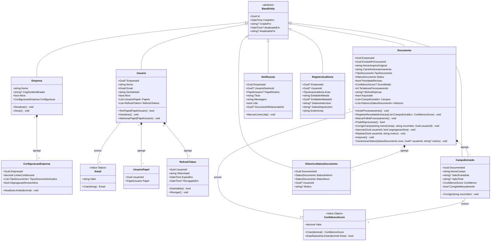
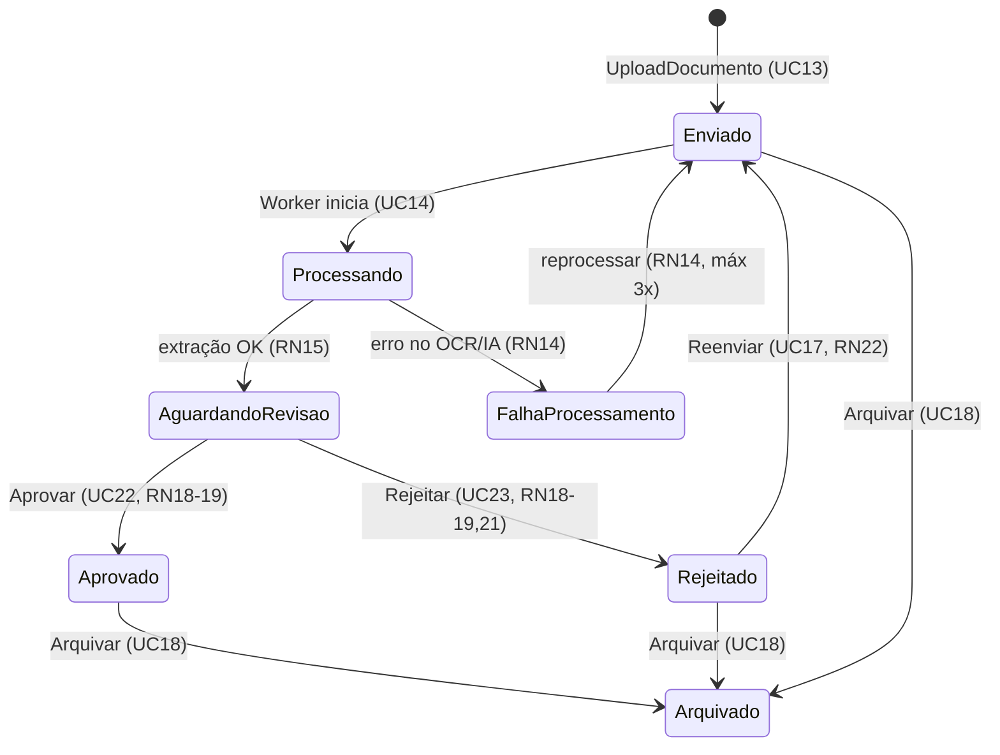

# IntelliDoc — Diagrama de Classes do Domínio

## 1. Agregados (Aggregate Roots) identificados

| Aggregate Root | Entidades filhas (dentro do agregado) | Value Objects |
|---|---|---|
| `Empresa` | `ConfiguracaoEmpresa` | — |
| `Usuario` | `UsuarioPapel`, `RefreshToken` | `Email` |
| `Documento` | `CampoExtraido`, `HistoricoStatusDocumento` | `ConfidenceScore` |
| `Notificacao` | — | — |
| `RegistroAuditoria` | — | — |

**Por que `Documento` é o agregado central:** todas as regras de transição de
status (RN13 a RN24) só fazem sentido garantidas **atomicamente** — não é
possível, por exemplo, aprovar um documento sem gerar o registro de
histórico correspondente na mesma operação. Por isso `CampoExtraido` e
`HistoricoStatusDocumento` não têm repositório próprio: só são
alterados **através** do agregado `Documento`, nunca diretamente.

## 2. Diagrama de Classes (Mermaid)

## 3. Máquina de Estados do `Documento` (regra central do domínio)

**Por que isso vira código:** o método privado `Documento.TransicionarStatus`
é o **único** ponto do sistema que altera `Status` — ele valida se a
transição solicitada é permitida por este diagrama (RN19) e, se não for,
lança `TransicaoStatusInvalidaException` (definida na Etapa 5). Isso
significa que é **impossível**, por construção, um documento pular de
`Enviado` direto para `Aprovado` sem passar pelos estados intermediários,
mesmo que um bug em uma camada superior tente forçar isso.

## 4. Onde cada Regra de Negócio (RN) mora no código

| Regra | Classe/Método responsável |
|---|---|
| RN02 (isolamento tenant) | Global Query Filter no `ApplicationDbContext` (Infrastructure) — fora do Domain, é preocupação de persistência |
| RN13-RN14 (fila, retry) | `Documento.IniciarProcessamento()`, `Documento.MarcarFalhaProcessamento()`, `Documento.PodeReprocessar()` |
| RN15-RN16 (score, prioridade) | `Documento.RegistrarResultadoExtracao()` + `ConfidenceScore.EstaAbaixoDoLimiar()` |
| RN17 (soft delete) | `Documento.Arquivar()` |
| RN18-RN19 (quem aprova, transição válida) | `Documento.Aprovar()` / `Documento.Rejeitar()` (validação de papel é feita na Application, via Command Handler + `ICurrentUserService`; validação de transição é feita no Domain) |
| RN20 (preserva valor original da IA) | `CampoExtraido.Corrigir()` — nunca sobrescreve `ValorExtraidoIa`, só `ValorFinal` |
| RN21 (motivo obrigatório na rejeição) | `Documento.Rejeitar(usuarioId, motivo)` — lança `DomainException` se `motivo.Length < 10` |
| RN23 (auditoria da transição) | `Documento.TransicionarStatus()` sempre adiciona um `HistoricoStatusDocumento` |
| RN24 (bloqueio de autoaprovação) | `Documento.Aprovar(usuarioId, segregacaoAtiva)` — compara `usuarioId` com `EnviadoPorUsuarioId` |

## 5. Decisão de design: por que `Aprovar`/`Rejeitar` recebem parâmetros e não dependem de Services injetados

O agregado `Documento` **não recebe nenhuma dependência injetada** (sem
`IUsuarioRepository`, sem `IConfiguracaoService` dentro dele) — em vez
disso, os dados necessários para a decisão (`segregacaoAtiva`, por
exemplo) são **passados como parâmetro** pelo Command Handler, que já os
buscou previamente. Isso mantém o Domain **puro e testável** (testes
unitários instanciam um `Documento` e chamam `Aprovar(...)` sem precisar
de mocks de infraestrutura), delegando toda orquestração externa
(consultar configuração da empresa, verificar papel do usuário) para a
camada de Application — que é o lugar correto para orquestração, segundo
Clean Architecture.